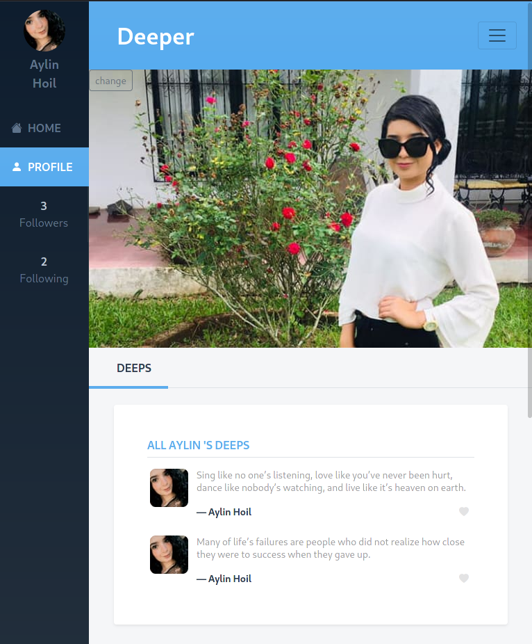
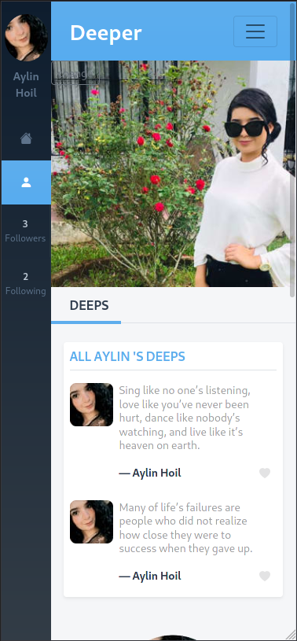

# Deeper

<blockquote align="left" width="100%">
   
  &nbsp;&nbsp;A social media webapp built with Ruby on Rails for sharing your deep daily quotes and wisdom.
</blockquote>
<br>
  


### Tablet
<hr>


<br>

<p align="center" width="100%">
    
</p>


<br>

### Smartphone
<hr>

  
<br>

<p align="center" width="100%">
     
    
</p>

<p align="center" width="100%">
    > 
       
</p>

<br>

### Desktop (click for full size)
<hr>


<br>


<p align="center" width="100%">
    
</p>

<br>
<br>

## Stop reading and visit now!
https://deeper-app.herokuapp.com/


<br>

## Video presentation

https://www.loom.com/share/a4a58954d7c64befb2a7bf15a9732d35

## Why is this project interesting/useful?

Users can visit every day to read deeps, or post them when they feel inspired.  Over time, a big network of wisdom and thoughtfulness can be created. 

## Features summary

- Ability to sign up, log in and log out users.
- Users can publish deeps (daily wisdom).
- In home, only the deeps from the user and his/her followeds show up.
- Ability to add profile photo and cover.
- Users can like deeps and view how many people liked them.
- All uploaded user photos and covers are processed in the cloud.
- Shows a list of unfollowed users in the 'Deepers to follow' section.

### What's planned for the future


- Ability to delete own deeps.
- UI/UX improvements
- Ability to let users choose their cover image gravity.
- A new logo.
- Tags/categories for deeps.
- Ability to edit user profile.


## Built With

- Ruby v2.7.3
- Ruby on Rails v6.1
- Cloudinary
- Rspec
- Active Storage


### Setup development environment on your machine


- Ruby must be installed first.

- Clone this repo to a folder.

```bash
   git clone https://github.com/Meltrust/deeper.git
```

- Install gems with:

```bash
   bundle install
```

- Setup database with:

```bash
   rails db:create
   rails db:migrate
```

- Start server with:

```bash
   rails server
```
- Lastly, open `http://localhost:3000/` in your browser.


- You can run the Rspec tests with:

```bash
    rspec --format documentation
```


## Author

🧑‍💻 **Miguel Tapia**
- GitHub: [@meltrust](https://github.com/meltrust)
- Twitter: [@meltrustDVX](https://twitter.com/meltrustDVX)
- LinkedIn: [Miguel(meltrust) Tapia Escalera](https://www.linkedin.com/in/meltrust/)

## 🤝 Contributing
Contributions, issues, and feature requests are welcome!

## Show your support
Give a ⭐️ if you like this project!


## 📝 License

This project is [MIT](LICENSE) licensed.
